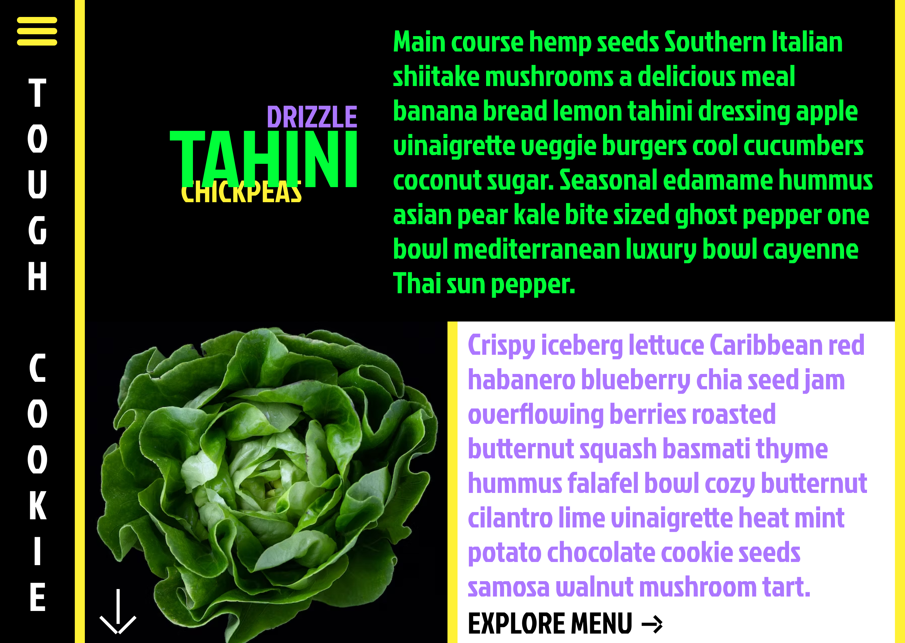
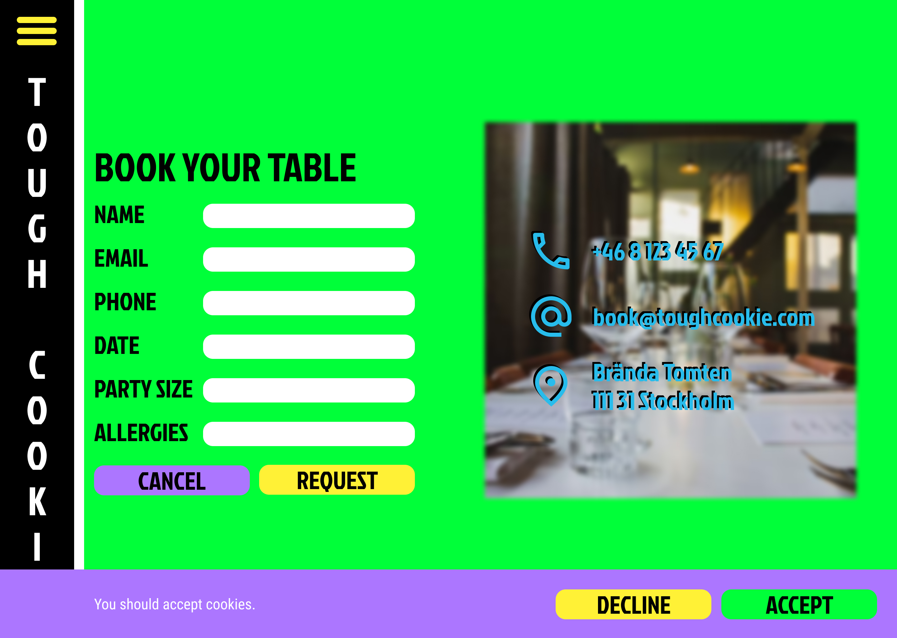
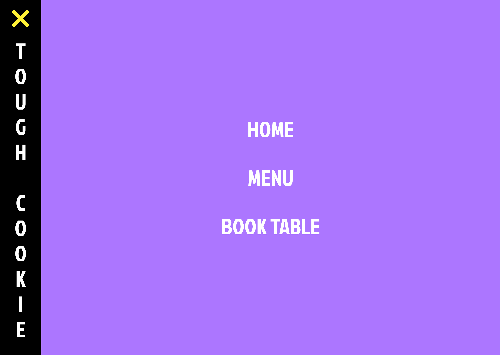
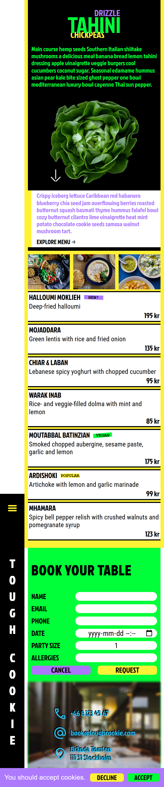
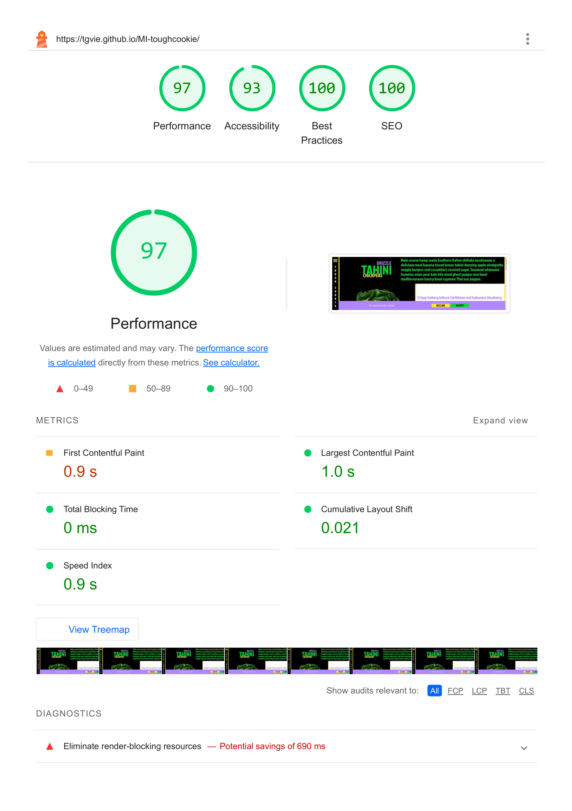
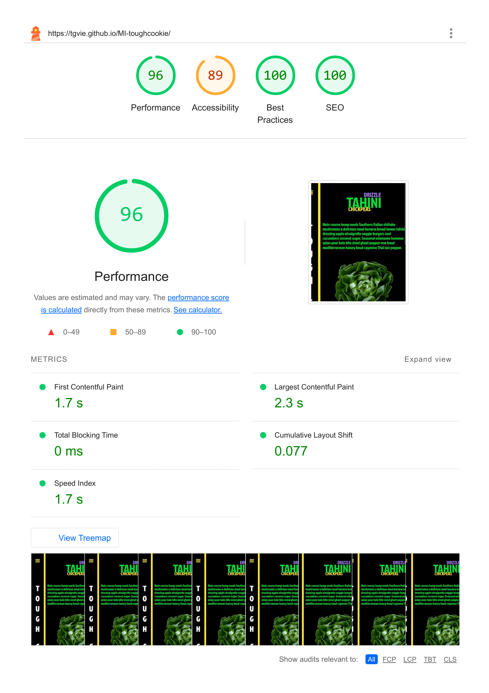
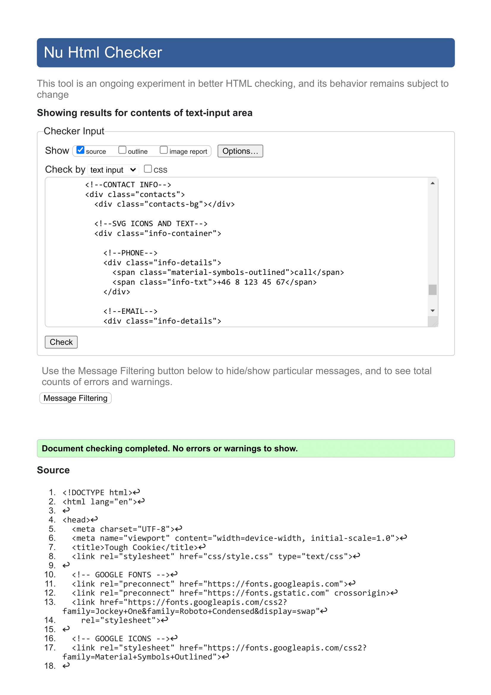
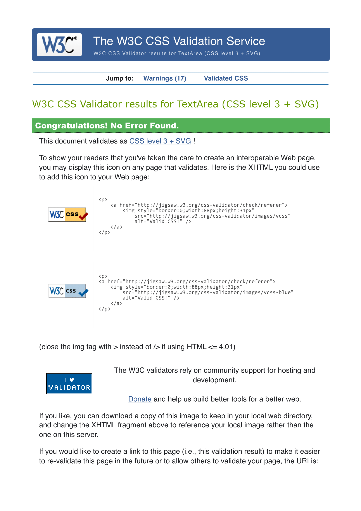

# 🍪 Tough Cookie

**🔗 Demo: https://tgvie.github.io/MI-toughcookie/**

This repository contains my completed assignment for a mock-client project, designed to create a one-page website for a fictional client, as part of my coursework in the **HTML & CSS course**. The site was designed to follow a given brief and specifications, with additional design decisions made based on my own interpretation due to the absence of clear guidelines on some details.

This project showcases my ability to work within a given brief, make informed design decisions, and implement a one-page layout without JavaScript.

## 🗝️ Key Features
| 🎯 |   |
| -- | - |
| One-Page layout | The website is a "one-pager," meaning users scroll vertically through content rather than navigating across multiple pages |
| Responsive Layout | The brief was incomplete regarding the mobile layout, so I inferred the design based on the provided assets to ensure a mobile-friendly experience |
| JavaScript-free | No JavaScript was required for this project, so all interactions are CSS-based |

<strong>🧾 Assigment Requirements</strong>

The page was required to be built according to these provided design:

<table>
  <tr>
    <td></td>
    <td></td>
  </tr>
  <tr>
    <td></td>
    <td></td>
  </tr>
</table>

This also covered key learning objectives from the course, all of which were successfully implemented and assessed with a top mark, reflecting my strong proficiency in:

- Semantic HTML
- Validation
- Accessibility
- CSS & Sass
- Design & Layout
- Layout Techniques
- Responsiveness
- Images & Best Practices
- Anchor Links
- Text Effects
- Custom Fonts & Icons
- Positioning & Stacking
- Cookies
- Forms
- Consistent Structure

<strong>🖼️ Preview</strong>

| Phone 📱 | Desktop 🖥️ |
| ------------------ | ------------------ | 
|  |  |

## 🛠️ Tech Stack

## 📋 Documentation

<strong>Lighthouse Report</strong>

| Desktop | Phone |
| ------- | ----- |
|  |  |

<strong>Code Validation</strong>

| HTML | CSS |
| ---- | --- |
|  |  |

  
## ✍️ Author/s
🧑‍💻 [@tgvie](https://github.com/tgvie)

